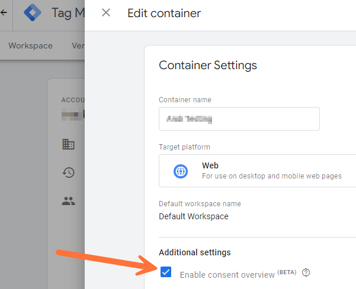
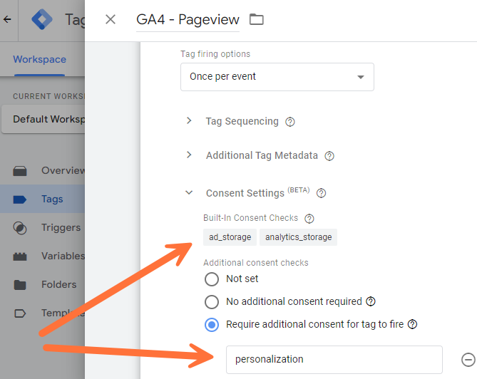

# aGTM - a Galactic Tagging Modulator


## Table of Contents

- [What is it for? - General Information](#what-is-it-for----general-information)
- [Usage](#usage)
- [Configuration options](#configuration-options)
- [Consent Handling](#consent-handling)
- [Optout](#optout)
- [Integration options for Google Tag Manager](#integration-options-for-google-tag-manager)
- [GTM Custom Templates for the use with aGTM](#gtm-custom-templates-for-the-use-with-agtm)
- [DataLayer Events that aGTM uses](#datalayer-events-that-agtm-uses)
- [Extensions](#extensions)
- [Debugging](#debugging)
- [Frequently Asked Questions (FAQ)](#frequently-asked-questions--faq-)
- [Author and Contact](#author-and-contact)
- [Changelog](#changelog)

---

## What is it for? - General Information

aGTM can help you to make your life easier, if you use the Google Tag Manager depending on user consent.

### In short

The “aGTM” provides functions for an easier and more data privacy friendly integration/handling of Google Tag Manager. GTM will not be fired before or without consent. In addition there is some basic functionality provided for the use in GTM Custom Templates. And there are some cool GTM Custom Templates ...

### Something more detailed

Handling Google Tag Manager and (cookie) consent is often very tiring and frustrating.
Especially when, for example, eCommerce events come into the GTM dataLayer, but the consent information only comes later, the setup in Google Tag Manager becomes difficult.
If there is also a requirement to use Google Consent Mode with GTM, further problems arise.
This Javascript library replaces the normal code to integrate the Google Tag Manager into the website.
The advantage is that the (cookie) consent information is already available before the Google Tag Manager is loaded. Or (in other words) the Google Tag Manager is only loaded when the consent is available. And (depending on the configuration) only if the visitor has agreed to the delivery of the GTM in the consent banner - so it is also a very data protection-friendly solution.
In any case, with the GTM setup you no longer have to worry about whether and when the consent is available, but can take care of the actual setup.

### Even more information

Feel free to use or change the code. If you have suggestions for improvement, please write to me.
**Licence:** MIT License
**Repository:** [Github aGTM Repository](https://github.com/Andiministrator/aGTM)

---

## Usage

Some help for the usage of aGTM:

### Complete short integration code example

Before you include the code to your website (template), you need to upload the necessary files. In this code example it was uploaded to the public directory /templates/scripts/.
*For Consentmanager and without consent mode support*:

```html
<!-- aGTM Start -->
<script type="text/javascript">
(function(c){
var w=window,d=document;w.aGTM=w.aGTM||{};aGTM.d=aGTM.d||{};aGTM.d.f=aGTM.d.f||[];aGTM.f=aGTM.f||{};aGTM.f.fire=aGTM.f.fire||function(o){aGTM.d.f.push(o);};
aGTM.c=c;var s='script',t=d.createElement(s),m=c.min?'.min':'',p=c.path||'';if(p.length>0&&p.substring(p.length-1)!=='/')p+='/';if(p)t.src=p+'aGTM'+m+'.js';t.async=true;
t.onload=function(){(aGTM.f.init?aGTM.f.init:function(){console.warn('aGTM.f.init missing');})();};d.head.appendChild(t);
})({
   path: '/templates/scripts/'
  ,cmp: 'consentmanager'
  ,gtm: { 'GTM-XYZ123': {} }
  ,gtmPurposes:'Funktional'
  ,gtmServices:'Google Tag Manager'
});
</script>
<!-- aGTM End -->
```

### Normal Usage in explained steps

This is the normal usage, where you upload the aGTM folder to your webserver.
_There is also a possibility to use it just in one file (or Javascript code), see the next chapter for that._
To use it as normal, follow these steps:

1. **Upload the necessary files**
   Upload the necessary files, that means at least the library itself (aGTM.js and/or the minified version aGTM.min.js) and the directory with the consent check function files.
   Assuming you uploaded aGTM direct to a directory "js", it should at least look like this:
   ```
   js/
     |--> cmp/
     |      |--> cc_ccm19.js
     |      |--> cc_ccm19.min.js
     |      |--> cc_magento_cc_cookie.js
     |      |--> ...
     |      `--> index.html
     |--> aGTM.js
     `--> aGTM.min.js
   ```

2. **Add the aGTM integration (with the configuration) script to your website templates**
   To understand, what settings you can use and what the meaning of each setting is, read the chapter "Configuration options".
   Here we give you an integration example with the most of available configuration options. In a normal setup you need just a few of them.
   Example integration code:
   ```html
   <!-- aGTM Start -->
   <script type="text/javascript" id="aGTMcontainer" nonce="abc123">
   (function(c){
   var w=window,d=document;w.aGTM=w.aGTM||{};aGTM.d=aGTM.d||{};aGTM.d.f=aGTM.d.f||[];aGTM.f=aGTM.f||{};aGTM.f.fire=aGTM.f.fire||function(o){aGTM.d.f.push(o);};
   aGTM.c=c;var s='script',t=d.createElement(s),m=c.min?'.min':'',p=c.path||'';if(p.length>0&&p.substring(p.length-1)!=='/')p+='/';if(p)t.src=p+'aGTM'+m+'.js';t.async=true;
   t.onload=function(){(aGTM.f.init?aGTM.f.init:function(){console.warn('aGTM.f.init missing');})();};d.head.appendChild(t);
   })({
   /* aGTM Config Start */
      path: '/js/' /* (relative) path to the directory where aGTM is located, e.g. '/js/'' */
     ,min: true /* inject the files as minified versions */
     ,cmp: 'cookiebot' /* Type of Consent Tool (Cookie Banner) you use in lower case, e.g. 'cookiebot'. See chapters below for possible options. */
     ,nonce: 'ABC123' /* Nonce value for the file injections */
     ,gtm: { 'GTM-XYZ123': { 'debug_mode':true } } /* your GTM Container - with ID, ... */
     ,gtmPurposes: 'Functional' /* The purpose(s) that must be agreed to in order to activate the GTM (comma-separated) */
     ,gtmServices: 'Google Tag Manager' /* The services(s) that must be agreed to in order to activate the GTM (comma-separated), e.g. 'Google Tag Manager' */
     ,gtmVendors: 'Google Inc' /* The vendor(s) that must be agreed to in order to activate the GTM (comma-separated) */
     ,gdl: 'dataLayer' /* Name of GTM dataLayer */
     ,dlStateEvents: true /* Fire GTM dataLayer Events for DOMloaded and PAGEready */
     ,useListener: false /* Use an event listener to check the consent (true). If it is false, a timer will be used (default) to check the consent */
     ,consent_events: 'cmpEvent,cmpUpdate' /* string with consent events (comma-separated) for updating the consent (leave it blank you you don't know, what it is) */
   /* aGTM Config End */
   });
   </script>
   <!-- aGTM End -->
   ```

3. _optional_ **Send events**
   You can now send events using the following command:
   ```javascript
   aGTM.f.fire({ event:'button_click', button:'Sign Up Button' });
   ```

### One-File Usage in explained steps

With this integration variant you get out a Javascript code, which conatins all you need. You can use this code either to have just one Javascript file or to integrate it in a CMS script field, or GTM container or whatever you have.

1. **Insert the consent_check function code to the aGTM.js**
   Open the aGTM.js (or better aGTM.min.js) file with your Text- or Code-Editor and place your cursor at the end of the file.

2. **Get the code of the consent_check function and paste it to the aGTM file**
   Now you need to know, which Consent Tool (Cookie Banner) you use for your website. See the point "cmp" in the chapter "Configuration options" for available Consent Tools.
   You'll find a folder with the name "cmp" within the project folder. This folder contains different files, two files for one Consent Tool (each in a normal and a minimized version). Open the file for your Consent Tool in a Text- or Code-Editor (we recommend to use the minimized version).
   Copy the file's code to your clipboard.
   _Notice:_ You don't need to copy the first part of the file. You can start from the part with `aGTM.f.consent_check = function `...
   Open the aGTM.js file (or aGTM.min.js), go to the end of the file and press <Enter> for a new line.
   Paste the copied code for the CMP function and press <Enter> again for another new line.
   Leave the file open.

3. **Add the configuration**
   Now we need to add the configuration after the inserted consent_check function.
   Use the following (minimal) code as example and change the settings to your needs.
   To understand, what settings you can use and what the meaning of each setting is, read the chapter "Configuration options".
   Example (minimal) integration code:
   ```javascript
   aGTM.f.config({
      gtm: { 'GTM-XYZ123': {} } /* your GTM Container - with ID, ...*/
     ,gtmServices: 'Google Tag Manager' /* The services(s) that must be agreed to in order to activate the GTM (comma-separated), e.g. 'Google Tag Manager' */
   });
   ```

4. **Add the init function**
   Go to the end of the file (after the just inserted configuration) and press <Enter> for a new line.
   Insert the following code:
   ```javascript
   aGTM.f.init();
   ```

5. **Save the aGTM file and use it**
   Now the code is complete. Save it and add it to your website templates.
   Here a (minimal) example of code with Cookiebot as cmp function for the One-File-Usage what has to be after the normal aGTM code:
   ```javascript
   aGTM.f.consent_check=function(t){if("string"!=typeof t||"init"!=t&&"update"!=t)return"function"==typeof aGTM.f.log&&aGTM.f.log("e10",{action:t}),!1;if(aGTM.d.consent=aGTM.d.consent||{},"init"==t&&aGTM.d.consent.hasResponse)return!0;if("object"!=typeof Cookiebot)return!1;var n=Cookiebot;if("boolean"!=typeof n.hasResponse||"object"!=typeof n.consent)return!1;if(!n.hasResponse)return!1;var e=aGTM.c.purposes?aGTM.c.purposes.split(","):[],o=0,r=0;for(k in n.consent)"stamp"!=k&&"method"!=k&&"boolean"==typeof n.consent[k]&&(r++,n.consent[k]&&(o++,e.push(k)));aGTM.d.consent.purposes=e.length>0?","+e.join(",")+",":"";var s="Consent available";return 0==r?s="No purposes available":o<=r?s="Consent (partially or full) declined":o>r&&(s="Consent accepted"),aGTM.d.consent.feedback=s,"string"==typeof n.consentID&&(aGTM.d.consent.consent_id=n.consentID),aGTM.d.consent.hasResponse=!0,"function"==typeof aGTM.f.log&&aGTM.f.log("m2",JSON.parse(JSON.stringify(aGTM.d.consent))),!0};
   aGTM.f.config({
      gtm: { 'GTM-XYZ123': {} }
     ,gtmPurposes: 'statistics'
   });
   aGTM.f.init();
   ```
   _Notice:_ If you want to insert the code into a HTML template, don't forget to add `<script>` before and `</script>` after the code.
   You can also use the code in a GTM container (as Custom HTML Code).
   We recommend to minify the code (e.g. with https://minify-js.com/). Keep care that you don't minify the function names (option "keep_fnames" for minify-js.com).

6. _optional_ **Send events**
   Pleas use our GTM templates (find it in the folder "gtm") for a lot of auto-events.
   You can also use the integrated aGTM fire function to send events using Javascript:
   ```javascript
   aGTM.f.fire({ event:'button_click', button:'Sign Up Button' });
   ```

---

## Configuration options

There are a lot configuration options. But you need only to use the options, where you want another setting as the default value.

### debug

If this is true, the optout cookie will be ignored

- Type: boolean
- Example: `true`
- Default: `false`

### path

The (relative) path to the directory where aGTM is located, e.g. '/js/''

- Type: string
- Example: `'/js/'`
- Default: `''`

### cmp

Type of Consent Tool (Cookie Banner) you use in lower case, e.g. 'cookiebot'.
Find the available options in the document [aGTM - Supported Consent Tools (CMP)](cmp/README-cmp.md).
Use `none` to skip the Consent Check.

- Type: string
- Example: `cookiebot`
- Default: `''`

### min

Inject the files as minified versions

- Type: boolean
- Example: `false`
- Default: `true`

### nonce

Nonce value for the file injections. If it is set, the nonce will be added to all script-injections.

- Type: string
- Example: `ABC123`
- Default: `''`

### useListener

Use an event listener to check the consent (true). If it is false, a timer will be used (default) to check the consent.
You should add the following command to your Consent Event Listener:
`aGTM.f.call_cc();`
The function returns `true`, if the consent info has loaded successful, otherwise `false`.
Make sure, that the aGTM lib is loaded before the event listener runs!*
If you don't know what that means, leave this option to false (default).
For more information, read the chapter "[Use Event Listeners instead of the default timer](#use-event-listeners-instead-of-the-default-timer)".

- Type: boolean
- Example: `true`
- Default: `false`

### gdl

Name of GTM dataLayer

- Type: string
- Example: `'dataLayer'`
- Default: `'dataLayer'`

### dlOrgPush

If the (GTM-)original dataLayer.push Function is changed (hooked), send an exception event ("log") or use the original dataLayer.push ("use") or replace the hooked dataLayer.push ("restore"). If you don't want to use it, leave it blank.
Possible Values:
- ""
  Do nothing.
- "log"
  Attach a flag/attribute to the dataLayer object with the name "dlPushFunction" and the value "overwritten".
- "use"
  Use the original (GTM) dataLayer.push function if it was overwritten (hooked) instead of the new (hooked) one.
- "restore"
  Restores the overwritten (hooked) dataLayer.push function with the original (GTM) one.

- Type: string
- Example: `"log"`
- Default: `""`

### dlStateEvents

Fires GTM dataLayer Events for `DOMloaded` and `PAGEready`

- Type: boolean
- Example: `true`
- Default: `false`

### aPageview

Fires a GTM dataLayer Event `aPageview` after the page has load and (a)GTM is ready.

- Type: boolean
- Example: `true`
- Default: `false`

### vPageview (deprecated)

Fires a GTM dataLayer Event `vPageview` after the page has load and (a)GTM is ready.
**Attention!** The vPageview event was replaced by the aPageview event in aGTM 1.4 and will be removed in aGTM 2.0!

- Type: boolean
- Example: `true`
- Default: `false`

### vPageviews

Send (dataLayer) Events if the URL changes, but no page reload takes place (virtual Pageviews through History Change).
The GTM dataLayer Event for a virtual Pageview has the event name `vPageview`.
*Notice:* There are two more configuration options (`vPageviewsTimer` and `vPageviewsFallback`). At normally you don't need to use them. Read the developer docu for more information about it.

- Type: boolean
- Example: `true`
- Default: `false`

### sendConsentEvent

If it set to true, a separate Consent Event named `aGTM_consent` will be fired (after Consent Info is available)

- Type: boolean
- Example: `true`
- Default: `false`

### gtm

The object with the GTM containers to inject (GTM container ID as key, options as value).

- Type: object
- Simple Example: `{ 'GTM-XYZ123': {} }`
- Default: `undefined`
- Possible Options:
  - **noConsent**
    This GTM has to be fired without consent check.
    In this case there will be fired an additional dataLayer Event called "aGTM_consent", containing the Consent Information.
    _Attention!_ The "aGTM_ready" event could be fired without consent information - keep care if you use other GTM container.
    - Type: boolean
    - Example: `true`
    - Default: `false`
  - **gtmURL**
    If you use an own url to the GTM (e.g. using the serverside Google Tag Manager), you can set your URL here. Leave it blank if you don't know what this means.
    If this option is not set (or if it is empty) the standard GTM URL will be used (https://www.googletagmanager.com/gtm.js).
    - Type: string
    - Example: `'https://tm.my-own-website.org/my-gtm.js'`
    - Default: `''`
  - **gtmJS**
    Possibility to give the GTM JS direct as Javascript content, but Base64-encoded. In this case, no external JS script will be loaded.
    - Type: string
    - Example: The content of the JS file https://www.googletagmanager.com/gtm.js?id=GTM-XYZ123
    - Default: `''`
  - **env**
    Environment string (leave it blank you you don't know, what it is)
    - Type: string
    - Example: `'&gtm_auth=ABC123xyz&gtm_preview=env-1&gtm_cookies_win=x'`
    - Default: `''`
  - **idParam**
    URL Parameter Name for the GTM ID
    - Type: string
    - Example: `'st'`
    - Default: `'id'`
  - *Other, optional (GTM-special) options*
    - Type: string
    - Example: `'debug_mode':true`
    - Example with options: `{ 'GTM-XYZ123': { env:'&gtm_auth=ABC123xyz&gtm_preview=env-1&gtm_cookies_win=x', 'debug_mode':true } }`

### gtmPurposes

The purpose(s) that must be agreed to in order to activate the GTM (comma-separated)

- Type: string
- Example: `'Functional'`
- Default: `''`

### gtmServices

The services(s) that must be agreed to in order to activate the GTM (comma-separated)

- Type: string
- Example: `'Google Tag Manager'`
- Default: `''`

### gtmVendors

The vendor(s) that must be agreed to in order to activate the GTM (comma-separated)

- Type: string
- Example: `'Google Inc'`
- Default: `''`

### consent_events

string with consent events (comma-separated) for updating the consent
For more Information, read the chapter [Updating Consent Information](#updating-consent-information)

- Type: string
- Example: `'cmpEvent,cmpUpdate'`
- Default: `''`

---

## Consent Handling

### Use Event Listeners instead of the default timer

By default, a timer is used to check whether the initial consent information is available. It will check every 100ms, whether the user hase given his consent (or declined it).
If you have the possibility to use an Event Listener for this, you can set the option "useListener" to true. In this case, no timer will start. But you need to add the following command to your Event Listener function:
`aGTM.f.call_cc();`
This command should run after the user has initial decided for consent.
The function returns `true`, if the consent info has loaded successful, otherwise `false`.
*Don't use it for consent update - read therefor the next point).*

### Updating Consent Information

There are two options to update existing consent information (e.g. if the user accept the consent in the first step but declines it later on).
The **first option** is to send an event with a special name to the dataLayer. You can configure the event name(s) with the config option "consent.consent_events". If you have more than one event name, you can configure more event names (comma-separated).
If an event comes into the dataLayer with one of the configured event names, the consent will be re-checked and updated.
The **second option** is to run the update function through an event listener. Add the following command to the Event Listener for updating the consent info:
`aGTM.f.run_cc('update')`
*Don't use this command for the initial check of the consent. Read therefore the point above.*

### See consented Purposes and Vendors

You can check, which purposes and vendors have consent by the following command (enter it in the browser console):
`aGTM.d.consent`
If it is empty (or undefined), the aGTM got no consent information (yet).

### GTM and/or GTAG Purposes and Vendors

There are 4 config options to inject the GTM consent-depending:

- gtmPurposes
- gtmServices
- gtmVendors

You can use it to inject the GTM only if the regarding consent for it was given.
That means, you can add one or more purpose(s), service(s) or vendor(s) to the option(s). If there is one or more missing consent of it, the GTM or GTAG will not be injected (only if all configured purposes and vendors have consent).

### consent_events

Here you can specify one (or more) event name(s) (comma-separated), which are used for updating the consent information, e.g.: `consent_events:'cmpEvent,cmpUpdate'`
If such an event was sent (through aGTM.f.fire), the internal consent check runs and updates the consent info (and sends the internal consent update event `aGTM_consent_update`).
You can even add one or more parameters that have to match for recognizing the event as a consent update event.
Therefore you just add the parameter(s) with it value in [] after the event name, e.g. `consent_events:'cmpEvent[userChoiceType:useraction]'`.
If a parameter just have to exists, but the value doesn't matter, you can leave out the value, e.g.: `consent_events:'cmpEvent[userChoiceType]'`.

### Consent Mode Settings in Google Tag Manager

To activate the Google Consent Mode in GTM, you should enable the consent overview in the GTM Container Settings:

All other settings are in each GTM Tag. There you can configure, for what service (Consent Type Name) the consent is needed:

The Tag is only fired, if alle configured services (in that special tag) have consent. In case the tag is triggered and should be fired, but the consent is not available yet (or denied), the Tag can wait. If the consent comes later, the tag will be fired than (at normally). Because you use the aGTM, you'll not need this GTM feature in most cases - you have the consent always from the GTM start. So it is only interesting, if a user declines the consent and accept it later on the same pageload.

### Skip the Consent Check

You can skip the consent check either for one (or several) GTM integrations or even for the whole aGTM Setup.
The Consent will be set to true in this cases and GTM will be injected immediatly and independend of the Consent State.

#### Skip Consent Check for the whole aGTM Setup

You can skip the Consent Check for the whole aGTM Setup, using the Configuration Option `cmp`.
Just set this option to `none` and all integration take place without checking the consent.

Example of aGTM configuration:

```javascript
aGTM.f.config({
   gtm: { 'GTM-XYZ123': {} }
  ,cmp: 'none'
});
```

See also chapter "Configuration Options" and especially "cmp".

#### Skip Consent Check just for one (or some) GTM integration(s)

It is also possible to skip the Consent Check just for special GTM integrations.
Use the GTM setting `noConsent` therefore. Just add the GTM parameter `noConsent` with the value `true` to the GTM container where you want to skip the Consent Check.

Example of aGTM configuration:

```javascript
aGTM.f.config({
   cmp: 'cookiebot'
  ,gtm: {
      'GTM-XYZ123': {}
     ,'GTM-XYZ234': { noConsent: true }
   }
  ,gtmPurposes: 'statistics'
});
```

See also chapter "Configuration Options" and especially "gtm".

---

## Optout

You can use an OptOut option of aGTM. Therefore exists the URL Parameter `aGTMoptout`.

If you add it to an URL and set the value to `1`, the execution of the aGTM will stop, all aGTM settings and data will be destroyed and an OptOut (Session) Cookie `aGTMoptout` will be set with the value of `1`.
The cookie ensures that the opt-out remains active for the current session.

You can stop the opt-out state using the URL Parameter `aGTMoptout` with the value `0`. This removes the OptOut Cookie.

**Opt-Out enabled together with Debug enabled**

If you use the aGTM Setting `debug` with the value `true`, an existing opt-out state will be ignored.
You could use this to de-activate an aGTM within a Live-Website (using the opt-out) and inject after that your own aGTM code (with enabled debug).

**Callback Function**

You can use a Callback Function named `aGTM.f.optout_callback` - it will run after the aGTM OptOut was excecuted.

**OptOut Functionality in short**

* - Checks if the URL contains the `aGTMoptout` parameter.
* - If `aGTMoptout` is set and not equal to "0", sets a cookie `aGTMoptout` with value "1" and enables opt-out.
* - If `aGTMoptout` is equal to "0", removes the `aGTMoptout` cookie if it exists.
* - If no URL parameter is present, checks if a `aGTMoptout` cookie exists with a value greater than "0".
* - If opt-out is enabled, clears all properties of `aGTM` except `f`, reinitializes the object,
* and calls an optional callback function `aGTM.f.optout_callback`.

---

## Integration options for Google Tag Manager

There are three options to integrate the Google Tag Manager code:

- Normal use of Google Tag Manager
- Loading the GTM from an own URL
- Loading the GTM code direct as Javascript (Base64-encoded)
  These three options are explained below.

### Normal use of Google Tag Manager

This is just the normal integration option for using the Google Tag Manager as usual (from Google directly).
Therefore you just need to specify the GTM Container with the configuration option "gtm".
Don't use the configuration options "gtmURL" or "gtmJS".

### Loading the GTM from an own URL

If you use an own Google Tag Manager server (e.g. using the serverside GTM), you can specify an own URL therefore using the configuration option "gtm"/"gtmURL".
This will replace the standard GTM URL (https://www.googletagmanager.com/gtm.js).
In addition you need to set the GTM Container with the configuration option "gtm".
Don't use the configuration option "gtmJS".

### Loading the GTM code direct as Javascript (Base64-encoded)

In case you have the output of your Google Tag Manager container stored in a database or somewhere else, you can use this option.
The Javascript code must be assigned to the "gtm"/"gtmJS" configuration option (as string and base64-encoded).
The configuration option "gtmURL" will be ignored in this case.

---

## GTM Custom Templates for the use with aGTM

There are several Custom GTM Templates for the use with aGTM.
You'll find a list of it in the [GTM Template Documentation](gtm/README-gtm-templates.md). There is also a description of each GTM Template.

---

## DataLayer Events that aGTM uses

And there is also an Overview about the GTM dataLayer Events of aGTM and for the GTM Custom Templates.
You'll find the Event/Attributes Overview within the "assets" directory as [Excel file](assets/aGTM-Events.xlsx) or in this [Google Drive Sheet](https://docs.google.com/spreadsheets/d/1-kVwFAeEqyzorU7ri17Xg8Drvd2a03n-5EWB34KhfPU).

---

## Extensions

There are extensions available to extend the functionality of aGTM, e.g. to use it together with external tool.

Find the available extensions in the [aGTM Extension Documentation](ext/README-extensions.md).

---

## Debugging

All settings, data and functions are stored in only one object: `aGTM`
You can enter the name of the object (aGTM) into the browser console and you'll get all settings and all data for debugging.

Also, the library logs some errors or success messages into an internal array (aGTM.l). But this array contains only IDs of the messages. To understand it, you need our mapping:
There is an additional file for translating and printing these messages to the browser console.
The file has the name "aGTM_debug.js" and is hopefully uploaded.
To get the debug messages, follow these two steps:

1. Load the file by entering this line into the browser console:
   `var s=document.createElement('script'); s.src='https://www.YOUR-DOMAIN.COM/PATH/TO/aGTM_debug.js'; document.body.appendChild(s);`
   *Note: replace the domain and path to the file with your correct path*
2. Wait a second.
3. Enter this command into the browser console:
   `aGTM.f.view_log();`
   Now you get all the log messages. The last command gives you also an object with all messages.
   I hope, this helps you to find your problem.

---

## Frequently Asked Questions (FAQ)

Q: *Why is outdated Javascript code used, e.g. var instead of let/const or objects instead of classes?*
A: There are tracking setups where it is not possible to integrate source code directly. Sometimes you can enter a Google Tag Manager Container ID there, which will fire a Google Tag Manager.
You can use this to fire a second GTM container with this code, which then has the logic provided by this script.
It's not nice, but sometimes it's the only solution.
In any case, the Google Tag Manager unfortunately only accepts Javascript up to ECMAscript 5, which means we are tied to old spellings.

Q: *What happens if there are Events were pushed in the GTM dataLayer (or fired via aGTM.f.fire), before the GTM was injected?*
A: There is a GTM Custom Template you can use to repeat these events.

Q: *I want to understand how aGTM works, because I want to extend it or I want to use the internal functions for other purposes. Where can I find more information about that?*
A: Therefore we have started a [Developer Documentation](README-for-Developers.md).

---

## Author and Contact

Feel free to contact me if you found problems or improvements:

**Andi Petzoldt**
☛ https://andiministrator.de
✉ andi@petzoldt.net
🧳 https://www.linkedin.com/in/andiministrator/
🐘 https://mastodon.social/@andiministrator
👥 https://friendica.opensocial.space/profile/andiministrator
📷 https://pixelfed.de/Andiministrator
🎧 https://open.audio/@Andiministrator/
🎥 https://diode.zone/a/andiministrator/video-channels

---

## Changelog

- Version 1.4, *27.05.2025*
  - sStrf-function and -use improved
  - Bug in Click Listener Tag fixed (for Outbound Clicks)
  - Click Listener Tag has now a configurable outbound link click Event Name
  - Pageview Feature (and GTM template) can now recognize virtual Pageviews
    **Attention!** With the introduction of virtual pageviews, the event name of the "normal" pageview has changed from "vPageview" to "aPageview." Virtual pageviews are sent as "vPageview."
    The vPageview (with setting) is still available, but will be removed in version 2.0
  - dataLayer monitoring and restoring feature added (configurable)
  - **Attention!** The aGTM.js and aGTM.min.js are without `aGTM.f.init();` at the end
  - **Attention!** A new implamentation code for a normal integration
  - New Base64 aGTM Version (aGTM.base64) added, based on aGTM.min.js

- Version 1.3, *25.03.2025*
  - Added a aGTM Client Template for serverside GTM
  - Added own function for JSON.stringify to avoid Exceptions with Circular Objects
  - Problem solved, if DL entry is no object
  - Consent Check for Secure Privacy added
  - Consent Check for Perspective Funnel added

- Version 1.2.2, *10.02.2025*
  - Exception Handling for curious event objects
  - Bugfix for Initialization in combination for old CMP functions
  - MS Consent Mode bug fixed

- Version 1.2.1, *22.01.2025*
  - New and modified CMP Functions
  - Problems with missing aGTM.n object solved

- Version 1.2, *07.11.2024*
  - New option for "gtm" setting: noConsent - use it to fire GTM Container without consent check
  - New option for "cmp" setting: none - use it if you don't want to check the consent
  - New Setting: "sendConsentEvent" - if it set to true, a separate Consent Event will be fired (after Consent Info is available)
  - Possibility added to load aGTM without loading a container
  - OptOut Function added, with clearing the aGTM object
  - Bugfix for loading more than one GTM container
  - MS Consent Mode added in GTM Consent Mode Template
  - New CMP Functions
  - GTM Templates are now within a subdiectory for each available Template
  - Some GTM Template Updates
  - README and inline comments updated

- Version 1.1.3, *27.06.2024*
  - Filter for GTM PINGs in fire Function added
  - New settings in GTM Repeat Template
  - New settings/infos in GTM Click Template

- Version 1.1.2, *19.06.2024*
  - Bugfix for JS Error Listener
  - Shopware Acris Cookie Check added
  - Clickskeks Cookiecheck added

- Version 1.1.1, *13.06.2024*
  - Bugfix for DOMready and PAGEready listener and vPageview template

- Version 1.1, *04.06.2024*
  - Improved functions for Custom GTM Template usage
  - New Custom GTM Template for vPageview or State Events (providing Device and Page Infos and Bot Detection)
  - **Attention!** The default values of `dlStateEvents` and `vPageview` have changed from `true` to `false`!

- Version 1.0.1, *28.05.2024*
  - Bugfix in config function (if cfg.consent hasn't exist)
  - Some adjustments in Docu and implementation script

- Version 1.0, *10.04.2024*
  - Initial Version of aGTM

---
