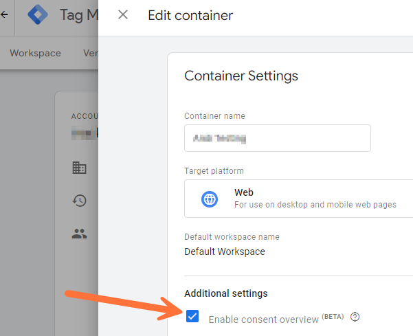
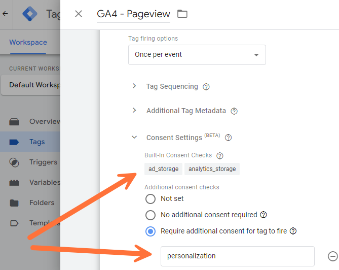

# aGTM - a Galactic Tagging Modulator


## Which document do you need?

| I want to … | Read |
|---|---|
| add aGTM to a website | this file |
| read aGTM's data in (server-side) GTM — session, consent, attribution | [README-for-Integrators.md](README-for-Integrators.md) |
| serve aGTM from my own server-side GTM | [sgtmClient/README.md](sgtmClient/README.md) |
| know which dataLayer events arrive, and when | [EVENTS.md](EVENTS.md) |
| debug a live integration in the browser | [devtools-extension/README.md](devtools-extension/README.md) — the aGTM Inspector |
| work on the library itself | [README-for-Developers.md](README-for-Developers.md) |

🇩🇪 Kurzeinstieg auf Deutsch: [README.de.md](README.de.md) · Interactive test page: [playground/index.html](playground/index.html)

---

## Table of Contents

- [What is it for? - General Information](#what-is-it-for----general-information)
- [Integration and Usage](#integration-and-usage)
- [Configuration options](#configuration-options)
- [Consent Handling](#consent-handling)
- [Optout](#optout)
- [Integration options for Google Tag Manager](#integration-options-for-google-tag-manager)
- [Loading a GTM environment (staging / preview)](#loading-a-gtm-environment-staging--preview)
- [POST Transport](#post-transport)
- [GTM Custom Templates for the use with aGTM](#gtm-custom-templates-for-the-use-with-agtm)
- [DataLayer Events that aGTM uses](#datalayer-events-that-agtm-uses)
- [Extensions](#extensions)
- [Troubleshooting](#troubleshooting)
- [Debugging](#debugging)
- [Frequently Asked Questions (FAQ)](#frequently-asked-questions--faq-)
- [Author and Contact](#author-and-contact)
- [Changelog](CHANGELOG.md)

---

## What is it for? - General Information

aGTM can help you to make your life easier, if you use the Google Tag Manager depending on user consent.

### In short

The “aGTM” provides functions for an easier and more data privacy friendly integration/handling of Google Tag Manager. By default, GTM is not loaded until a consent decision is available; which conditions have to be met is defined by the **Consent Check Conditions** of your setup, and a few documented options deliberately relax this — see [When aGTM loads GTM without a consent decision](#when-agtm-loads-gtm-without-a-consent-decision). In addition there is some basic functionality provided for the use in GTM Custom Templates. And there are some cool GTM Custom Templates ...

### Something more detailed

Handling Google Tag Manager and (cookie) consent is often very tiring and frustrating.
Especially when, for example, eCommerce events come into the GTM dataLayer, but the consent information only comes later, the setup in Google Tag Manager becomes difficult.
If there is also a requirement to use Google Consent Mode with GTM, further problems arise.
This Javascript library replaces the normal code to integrate the Google Tag Manager into the website.
The advantage is that the (cookie) consent information is already available before the Google Tag Manager is loaded. Or (in other words) in the default setup the Google Tag Manager is only loaded once the consent decision is available. And (depending on the configuration) only if the visitor has agreed to the delivery of the GTM in the consent banner - so it is also a very data protection-friendly solution.
In any case, with the GTM setup you no longer have to worry about whether and when the consent is available, but can take care of the actual setup.

### Even more information

Feel free to use or change the code. If you have suggestions for improvement, please write to me.
**Licence:** Apache 2.0 License
**Repository:** [Github aGTM Repository](https://github.com/Andiministrator/aGTM)

---

## Integration and Usage

The easiest way to create the integration code for aGTM is to use the aGTM Configurator:
[aGTM Configurator](https://andiministrator.github.io/aGTM/configurator/index.html)

Now some help for the usage with the integration code of aGTM:

### Complete shortened integration code example

Here a shortened integration Code of aGTM.
Please don't use this code as it is, the code lines are not complete - it is just to show the order of Code.

```html
<!-- aGTM Start -->
<script type="text/javascript">
// aGTM Library
window.aGTM=window.aGTM||{},... /* Place your minified aGTM Code in this line */
// CMP Check function
aGTM.f.consent_check=function(e){... /* Place your minified CMP Function Code in this line */
// aGTM Configuration
aGTM.f.config({
   gtm: { 'GTM-XXXXXXXX': {} }
  ,gtmServices:'Google Tag Manager'
});
// aGTM Init
aGTM.f.init();
</script>
<!-- aGTM End -->
```

### Recommended Integration Variant: One-File Usage in explained steps

With this integration variant you get out a Javascript code, which conatins all you need. You can use this code either to have just one Javascript file or to integrate it in a CMS script field, or GTM container or whatever you have.

1. **Insert the consent_check function code to the aGTM.js**
   Open the aGTM.js (or better aGTM.min.js) file with your Text- or Code-Editor and place your cursor at the end of the file.

2. **Get the code of the consent_check function and paste it to the aGTM file**
   Now you need to know, which Consent Tool (Cookie Banner) you use for your website. See the point "cmp" in the chapter "Configuration options" for available Consent Tools.
   You'll find a folder with the name "cmp" within the project folder. This folder contains different files, two files for one Consent Tool (each in a normal and a minimized version). Open the file for your Consent Tool in a Text- or Code-Editor (we recommend to use the minimized version).
   Copy the file's code to your clipboard.
   _Notice:_ You don't need to copy the first part of the file. You can start from the part with `aGTM.f.consent_check = function `...
   Open the aGTM.js file (or aGTM.min.js), go to the end of the file and press <Enter> for a new line.
   Paste the copied code for the CMP function and press <Enter> again for another new line.
   Leave the file open.

3. **Add the configuration**
   Now we need to add the configuration after the inserted consent_check function.
   Use the following (minimal) code as example and change the settings to your needs.
   To understand, what settings you can use and what the meaning of each setting is, read the chapter "Configuration options".
   Example (minimal) integration code:
   ```javascript
   aGTM.f.config({
      gtm: { 'GTM-XXXXXXXX': {} } /* your GTM Container - with ID, ...*/
     ,gtmServices: 'Google Tag Manager' /* The services(s) that must be agreed to in order to activate the GTM (comma-separated), e.g. 'Google Tag Manager' */
   });
   ```

4. **Add the init function**
   Go to the end of the file (after the just inserted configuration) and press <Enter> for a new line.
   Insert the following code:
   ```javascript
   aGTM.f.init();
   ```

5. **Save the aGTM file and use it**
   Now the code is complete. Save it and add it to your website templates.
   Here a (minimal) example of code with Cookiebot as cmp function for the One-File-Usage what has to be after the normal aGTM code:
   ```javascript
   aGTM.f.consent_check=function(t){if("string"!=typeof t||"init"!=t&&"update"!=t)return"function"==typeof aGTM.f.log&&aGTM.f.log("e10",{action:t}),!1;if(aGTM.d.consent=aGTM.d.consent||{},"init"==t&&aGTM.d.consent.hasResponse)return!0;if("object"!=typeof Cookiebot)return!1;var n=Cookiebot;if("boolean"!=typeof n.hasResponse||"object"!=typeof n.consent)return!1;if(!n.hasResponse)return!1;var e=aGTM.c.purposes?aGTM.c.purposes.split(","):[],o=0,r=0;for(k in n.consent)"stamp"!=k&&"method"!=k&&"boolean"==typeof n.consent[k]&&(r++,n.consent[k]&&(o++,e.push(k)));aGTM.d.consent.purposes=e.length>0?","+e.join(",")+",":"";var s="Consent available";return 0==r?s="No purposes available":o<=r?s="Consent (partially or full) declined":o>r&&(s="Consent accepted"),aGTM.d.consent.feedback=s,"string"==typeof n.consentID&&(aGTM.d.consent.consent_id=n.consentID),aGTM.d.consent.hasResponse=!0,"function"==typeof aGTM.f.log&&aGTM.f.log("m2",JSON.parse(JSON.stringify(aGTM.d.consent))),!0};
   aGTM.f.config({
      gtm: { 'GTM-XXXXXXXX': {} }
     ,gtmPurposes: 'statistics'
   });
   aGTM.f.init();
   ```
   _Notice:_ If you want to insert the code into a HTML template, don't forget to add `<script>` before and `</script>` after the code.
   You can also use the code in a GTM container (as Custom HTML Code).
   We recommend to minify the code (e.g. with https://minify-js.com/). Keep care that you don't minify the function names (option "keep_fnames" for minify-js.com).

6. _optional_ **Send events**
   Pleas use our GTM templates (find it in the folder "gtm") for a lot of auto-events.
   You can also use the integrated aGTM fire function to send events using Javascript:
   ```javascript
   aGTM.f.fire({ event:'button_click', button:'Sign Up Button' });
   ```

### Alternative Integration Variant: Web-Folder-based Usage in explained steps

This is the normal usage, where you upload the aGTM folder to your webserver.
_There is also a possibility to use it just in one file (or Javascript code), see the previous chapter for that._
To use it as normal, follow these steps:

1. **Upload the necessary files**
   Upload the necessary files, that means at least the library itself (aGTM.js and/or the minified version aGTM.min.js) and the directory with the consent check function files.
   Assuming you uploaded aGTM direct to a directory "js", it should at least look like this:
   ```
   js/
     |--> cmp/
     |      |--> cc_ccm19.js
     |      |--> cc_ccm19.min.js
     |      |--> cc_magento_cc_cookie.js
     |      |--> ...
     |      `--> index.html
     |--> aGTM.js
     `--> aGTM.min.js
   ```

2. **Add the aGTM integration (with the configuration) script to your website templates**
   To understand, what settings you can use and what the meaning of each setting is, read the chapter "Configuration options".
   Here we give you an integration example with the most of available configuration options. In a normal setup you need just a few of them.
   Example integration code:
   ```html
   <!-- aGTM Start -->
   <script type="text/javascript" id="aGTMcontainer" nonce="abc123">
   (function(c){
   var w=window,d=document;w.aGTM=w.aGTM||{};aGTM.d=aGTM.d||{};aGTM.d.f=aGTM.d.f||[];aGTM.f=aGTM.f||{};aGTM.f.fire=aGTM.f.fire||function(o){aGTM.d.f.push(o);};
   aGTM.c=c;var s='script',t=d.createElement(s),m=c.min?'.min':'',p=c.path||'';if(p.length>0&&p.substring(p.length-1)!=='/')p+='/';if(p)t.src=p+'aGTM'+m+'.js';t.async=true;
   t.onload=function(){(aGTM.f.init?aGTM.f.init:function(){console.warn('aGTM.f.init missing');})();};d.head.appendChild(t);
   })({
   /* aGTM Config Start */
      path: '/js/' /* (relative) path to the directory where aGTM is located, e.g. '/js/'' */
     ,min: true /* inject the files as minified versions */
     ,cmp: 'cookiebot' /* Type of Consent Tool (Cookie Banner) you use in lower case, e.g. 'cookiebot'. See chapters below for possible options. */
     ,nonce: 'ABC123' /* Nonce value for the file injections */
     ,gtm: { 'GTM-XXXXXXXX': { 'debug_mode':true } } /* your GTM Container - with ID, ... */
     ,gtmPurposes: 'Functional' /* The purpose(s) that must be agreed to in order to activate the GTM (comma-separated) */
     ,gtmServices: 'Google Tag Manager' /* The services(s) that must be agreed to in order to activate the GTM (comma-separated), e.g. 'Google Tag Manager' */
     ,gtmVendors: 'Google Inc' /* The vendor(s) that must be agreed to in order to activate the GTM (comma-separated) */
     ,gdl: 'dataLayer' /* Name of GTM dataLayer */
     ,dlStateEvents: true /* Fire GTM dataLayer Events for DOMloaded and PAGEready */
     ,useListener: false /* Use an event listener to check the consent (true). If it is false, a timer will be used (default) to check the consent */
     ,consent_events: 'cmpEvent,cmpUpdate' /* string with consent events (comma-separated) for updating the consent (leave it blank you you don't know, what it is) */
   /* aGTM Config End */
   });
   </script>
   <!-- aGTM End -->
   ```

3. _optional_ **Send events**
   You can now send events using the following command:
   ```javascript
   aGTM.f.fire({ event:'button_click', button:'Sign Up Button' });
   ```

---

## Configuration options

There are a lot configuration options. But you need only to use the options, where you want another setting as the default value.

### debug

If this is true, the optout cookie will be ignored

- Type: boolean
- Example: `true`
- Default: `false`

### path

The (relative) path to the directory where aGTM is located, e.g. '/js/''

- Type: string
- Example: `'/js/'`
- Default: `''`

### cmp

Type of Consent Tool (Cookie Banner) you use in lower case, e.g. 'cookiebot'.
Find the available options in the document [aGTM - Supported Consent Tools (CMP)](cmp/README-cmp.md).
Use `none` to skip the Consent Check.

- Type: string
- Example: `cookiebot`
- Default: `''`

### min

Inject the files as minified versions

- Type: boolean
- Example: `false`
- Default: `true`

### nonce

Nonce value for the file injections. If it is set, the nonce will be added to all script-injections.

- Type: string
- Example: `ABC123`
- Default: `''`

### useListener

Use an event listener to check the consent (true). If it is false, a timer will be used (default) to check the consent.
You should add the following command to your Consent Event Listener:
`aGTM.f.call_cc();`
The function returns `true`, if the consent info has loaded successful, otherwise `false`.
Make sure, that the aGTM lib is loaded before the event listener runs!*
If you don't know what that means, leave this option to false (default).
For more information, read the chapter "[Use Event Listeners instead of the default timer](#use-event-listeners-instead-of-the-default-timer)".

- Type: boolean
- Example: `true`
- Default: `false`

### iframeSupport

Enables aGTM inside an iframe context. When set to `true` and the page is running inside an iframe (`window.self !== window.top`), aGTM automatically grants consent and injects GTM — bypassing the normal CMP consent check. The iframe then listens for messages from the parent frame via `postMessage`.
Use this if you want to run GTM inside an iframe without requiring its own consent banner.
If the page is not an iframe, this setting has no effect.

- Type: boolean
- Example: `true`
- Default: `false`

### gdl

Name of GTM dataLayer

- Type: string
- Example: `'dataLayer'`
- Default: `'dataLayer'`

### dlOrgPush

If the (GTM-)original dataLayer.push Function is changed (hooked), send an exception event ("log") or use the original dataLayer.push ("use") or replace the hooked dataLayer.push ("restore"). If you don't want to use it, leave it blank.
Possible Values:
- ""
  Do nothing.
- "log"
  Attach a flag/attribute to the dataLayer object with the name "dlPushFunction" and the value "overwritten".
- "use"
  Use the original (GTM) dataLayer.push function if it was overwritten (hooked) instead of the new (hooked) one.
- "restore"
  Restores the overwritten (hooked) dataLayer.push function with the original (GTM) one.

- Type: string
- Example: `"log"`
- Default: `""`

### dlStateEvents

Fires GTM dataLayer Events for `DOMloaded` and `PAGEready`

- Type: boolean
- Example: `true`
- Default: `false`

### aPageview

Fires a GTM dataLayer Event `aPageview` after the page has load and (a)GTM is ready.

- Type: boolean
- Example: `true`
- Default: `false`

### vPageview (deprecated)

Fires a GTM dataLayer Event `vPageview` after the page has load and (a)GTM is ready.
**Attention!** The vPageview event was replaced by the aPageview event in aGTM 1.4 and will be removed in aGTM 2.0!

- Type: boolean
- Example: `true`
- Default: `false`

### vPageviews

Send (dataLayer) Events if the URL changes, but no page reload takes place (virtual Pageviews through History Change).
The GTM dataLayer Event for a virtual Pageview has the event name `vPageview`.
aGTM detects URL changes via `popstate`/`hashchange` event listeners and — where the browser supports it — by intercepting `history.pushState`/`replaceState` with a Proxy. See also `vPageviewsTimer` and `vPageviewsFallback` below.

- Type: boolean
- Example: `true`
- Default: `false`

### vPageviewsTimer

Polling interval in milliseconds for detecting URL changes when `vPageviews` is enabled.
Set to `0` (default) to disable polling entirely and rely solely on the Proxy/event-listener approach.
When set to a value > 0 and `vPageviewsFallback` is `false`, polling runs **always** alongside the other mechanisms.
When set to a value > 0 and `vPageviewsFallback` is `true`, polling runs **only** when the browser does not support the ES6 Proxy API.

- Type: number (milliseconds)
- Example: `500`
- Default: `0`

### vPageviewsFallback

Controls whether `vPageviewsTimer` polling is used as a fallback only (true) or always (false).
Only relevant when `vPageviewsTimer` is set to a value > 0.
- `false` (default): polling runs always if `vPageviewsTimer` > 0, regardless of Proxy support
- `true`: polling runs only if the browser does not support the ES6 Proxy API

- Type: boolean
- Example: `true`
- Default: `false`

### sendConsentEvent

If it set to true, a separate Consent Event named `aGTM_consent` will be fired (after Consent Info is available)

- Type: boolean
- Example: `true`
- Default: `false`

### gtm

The object with the GTM containers to inject (GTM container ID as key, options as value).

- Type: object
- Simple Example: `{ 'GTM-XXXXXXXX': {} }`
- Default: `undefined`
- Possible Options:
  - **noConsent**
    This GTM has to be fired without consent check.
    In this case there will be fired an additional dataLayer Event called "aGTM_consent", containing the Consent Information.
    _Attention!_ The "aGTM_ready" event could be fired without consent information - keep care if you use other GTM container.
    - Type: boolean
    - Example: `true`
    - Default: `false`
  - **gtmURL**
    If you use an own url to the GTM (e.g. using the serverside Google Tag Manager), you can set your URL here. Leave it blank if you don't know what this means.
    If this option is not set (or if it is empty) the standard GTM URL will be used (https://www.googletagmanager.com/gtm.js).
    - Type: string
    - Example: `'https://tm.my-own-website.org/my-gtm.js'`
    - Default: `''`
  - **gtmJS**
    Possibility to give the GTM JS direct as Javascript content, but Base64-encoded. In this case, no external JS script will be loaded.
    - Type: string
    - Example: The content of the JS file https://www.googletagmanager.com/gtm.js?id=GTM-XYZ123
    - Default: `''`
  - **env**
    Environment string (leave it blank you you don't know, what it is)
    - Type: string
    - Example: `'&gtm_auth=ABC123xyz&gtm_preview=env-1&gtm_cookies_win=x'`
    - Default: `''`
  - **idParam**
    URL Parameter Name for the GTM ID
    - Type: string
    - Example: `'st'`
    - Default: `'id'`
  - *Other, optional (GTM-special) options*
    - Type: string
    - Example: `'debug_mode':true`
    - Example with options: `{ 'GTM-XXXXXXXX': { env:'&gtm_auth=ABC123xyz&gtm_preview=env-1&gtm_cookies_win=x', 'debug_mode':true } }`
  - *comment*
    - Type: string
    - Example: `'Client XYZ'`

### gtmPurposes

The purpose(s) that must be agreed to in order to activate the GTM (comma-separated)

- Type: string
- Example: `'Functional'`
- Default: `''`

### gtmServices

The services(s) that must be agreed to in order to activate the GTM (comma-separated)

- Type: string
- Example: `'Google Tag Manager'`
- Default: `''`

### gtmVendors

The vendor(s) that must be agreed to in order to activate the GTM (comma-separated)

- Type: string
- Example: `'Google Inc'`
- Default: `''`

### gtmAttr

Additional HTML attributes to add to the GTM `<script>` tag. Useful e.g. for CMP attribute-based consent systems that require a specific `data-*` attribute on the script tag.

- Type: object
- Example: `{ 'data-cmp-ab': 'c905' }`
- Default: `null`

### dlSet

Object that maps event property names to GTM dataLayer variable names. When set, aGTM reads the specified variables from the GTM dataLayer and automatically appends them to every fired event.

- Type: object (key: target property name, value: dataLayer variable name)
- Example: `{ 'userId': 'user_id' }` — reads the GTM dataLayer variable `user_id` and adds it as `userId` to every event
- Default: `{}`

### consent_events

string with consent events (comma-separated) for updating the consent
For more Information, read the chapter [Updating Consent Information](#updating-consent-information)

- Type: string
- Example: `'cmpEvent,cmpUpdate'`
- Default: `''`

### user_id

Optional logged-in user CRM ID. Stored on `aGTM.d.session.uid` so integrators / GTM tags can read it. Not used internally by aGTM since v1.5 — session/uid resolution moved server-side into the sGTM Client.

- Type: string
- Example: `'u-12345'`
- Default: `''`

### session_salt

Numeric salt used to obfuscate the consent-store POST payload (when `consent_store_enc: true`). Also serves as a fallback salt for the POST transport feature when no per-event salt and no `transport_salt` is configured. Same algorithm as `aGTM.f.enc()` (Base64 + Caesar shift).

- Type: number (integer ≥ 1)
- Example: `42`
- Default: `0` (no encryption)

### consent_store_url

POST endpoint that aGTM sends consent diffs to (Phase 3 of the v1.5 redesign). The sGTM Client handler manages the user-ID cookie AND persists the consent into the Session API record so the next library load returns it via `cfg.session.consent`. When the library is served by the sGTM Client, this URL is built **browser-side** at config time from `document.currentScript.src` + the fixed path `/aGTMconsent` — works under any reverse-proxy prefix transparently. Standalone integrators set this manually. Empty string disables the diff/store mechanism.

- Type: string
- Example: `'https://sgtm.example.com/aGTMconsent'`
- Default: `''`

### consent_store_enc

If `true`, the consent-store POST payload is obfuscated using `session_salt`.

- Type: boolean
- Example: `true`
- Default: `false`

### consent_poll_ms

Interval (ms) for the periodic CMP state-change poll started after the first successful init. Set to `0` to disable polling. Only takes effect when `consent_store_url` is set. Catches CMPs that emit consent-update events via direct `window.dataLayer.push()` (CCM19, Cookiebot, Usercentrics, …) — bypassing `aGTM.f.fire()` and the `consent_events` matcher — so the diff/POST mechanism still triggers. Default `2000` is a reasonable balance between latency and CPU.

- Type: number (≥ 0)
- Example: `1000`
- Default: `2000`

### session

Pre-populated session object from the sGTM Client. Accepted when it is an object containing a `sid` OR a `consent` field. When the optional `consent` block is valid (`hasResponse: true`, `services` is a string), aGTM seeds `aGTM.d.consent` + `aGTM.d.consent_hash` from it and triggers a synchronous `call_cc()` at the end of `config()` so GTM injects on the first tick — no CMP wait. Standalone integrators usually leave this unset.

- Type: object
- Example: `{ sid: 's-123', uid: 'u-42', consent: { hasResponse: true, services: ',svc1,' } }`
- Default: `null`

### transport_url

Endpoint URL for direct HTTP POST transport to a server-side backend (e.g., a sGTM collect endpoint or custom collection server). When set, events can be sent via `_post: true` in `aGTM.f.fire()`.

- Type: string
- Example: `'https://collect.example.com/ae'`
- Default: `''`

### transport_enc

Enable obfuscation of POST payloads using Base64 + Caesar shift encoding.

- Type: boolean
- Example: `true`
- Default: `false`

### transport_salt

Numeric salt for POST payload obfuscation. Must be an integer ≥ 1. If not set, `session_salt` is used as fallback.

- Type: number
- Example: `42`
- Default: `0` (no encryption)

---

### Accessing session state

After `aGTM.f.config()` runs (typically right at page-load when the library is served by the sGTM Client), the session result is available in two places:

- **`aGTM.d.session`** — the full session object passed in via `cfg.session` (empty `{}` if no session was supplied). When the sGTM Client's Sources API integration is enabled, it also carries the captured non-meta fields — notably **`aGTM.d.session.source`** (the affiliate source / `?source=` value by last-cookie-win), readable in webGTM via a plain "JavaScript Variable" pointing at `aGTM.d.session.source`.
- **`aGTM.d.attribution`** — keyed-by-method attribution object populated from `cfg.session.attribution` (sGTM Client) merged with the current URL/referrer. Empty `{}` when no attribution preset is supplied. Read fields like `aGTM.d.attribution.last_touch.sou`. See [Developer Documentation → Attribution](README-for-Developers.md#attribution-hybrid-merge) for the per-field merge rules.
- **`aGTM.d.session_status`** — consent-sync lifecycle string, readable from GTM Custom Variables or any JS on the page:

One of `""` (feature inactive), `"preset"`, `"preset_with_consent"`, `"synced"` or
`"confirmed"`. **What each value means and when it is set:**
[README-for-Integrators.md → Session status](README-for-Integrators.md#session_status-lifecycle)
— that table is the canonical one; this file deliberately does not repeat it, because
five copies of it had already started to drift apart.

Example use in a GTM Custom Variable (JavaScript Variable type):
```javascript
function() { return window.aGTM && window.aGTM.d ? window.aGTM.d.session_status : ''; }
```

The `"synced"` and `"preset_with_consent"` values are good metrics to watch in production — they tell you how often the sGTM Client's stored consent saved a CMP roundtrip.

### Server-side auto-denial (sGTM Client)

When the sGTM Client serves the library and the Session API has no recorded consent for a returning visitor (`counter > 0`), the Client constructs a denial-consent block server-side and embeds it in `cfg.session.consent`:

| Field | Value |
|---|---|
| `hasResponse` | `true` |
| `feedback` | `"Consent denied by aGTM"` |
| `services` | `",aGTMconsent,"` |
| `gtmConsent` | `true` if the `auto_deny_load_gtm` template option is on (default), otherwise `false` |
| `blocked` | mirrors `gtmConsent` (recognised by the `run_cc` chelp fallback) |

GTM tags configured to require the `aGTMconsent` service will fire; tags requiring any other consent signal will not.

If the user later makes an explicit decision in the CMP banner, the periodic CMP poll (`consent_poll_ms`) catches it within a couple of seconds, the diff is detected and POSTed to `consent_store_url`, and `aGTM.d.session_status` advances to `"synced"`. The auto-denial values are wiped by the B2-reset in `run_cc('update')` so the user choice always wins.

This logic lives entirely in the sGTM Client (template + `jsSourceCode.js`) — no client-side auto-denial code in aGTM since v1.5.

---

## Consent Handling

> **Loading the CMP itself before aGTM checks consent?** See the [CMP Loader Pattern](sgtmClient/README.md#cmp-loader-pattern) in the sGTM Client docs — a dedicated `noConsent` container is the recommended way; an inline script field in the sGTM Client template is available as a fallback.

### When aGTM loads GTM without a consent decision

aGTM's default is to wait for a consent decision before injecting GTM. That default is
not absolute — the cases below load GTM without one. Four of them are switches **you**
turn on deliberately, for good reasons; they are listed here so you can state them, not
because there is anything wrong with them. The exception is the second row: an empty
consent-condition table is what aGTM **ships with**, so that one applies until you
configure it. Check which of these apply before you rely on the default in a privacy
statement.

| Case | What happens | Configured in |
|---|---|---|
| **Consent check switched off** | No CMP is consulted at all. aGTM records `hasResponse: true` with the feedback *“No Consent Check configured”* and injects GTM right away. | `cmp: 'none'` |
| **No consent conditions configured** | The consent check has nothing to require, so it is satisfied by anything — including a rejection. GTM loads after “reject all”. | `gtmPurposes` / `gtmServices` / `gtmVendors`, resp. the *Consent Check Conditions* table of the sGTM Client. **Ships empty.** |
| **`noConsent` containers** | Containers marked `noConsent: true` are injected at startup, before any decision. Intended for loading a CMP or consent-free diagnostics. | `gtm` container table, column *Consent Check* |
| **Server-side auto-denial** | The sGTM Client records “no consent” for a returning visitor without a stored decision, and — with `auto_deny_load_gtm` (default **on**) — still loads GTM, so that only tags gated on `aGTMconsent` may fire. | sGTM Client, *auto_deny_load_gtm* |
| **iFrame mode** | Inside an iframe, aGTM grants consent itself and skips the CMP check — the decision is expected to have been made in the parent document, which runs its own check, and events are forwarded there via `postMessage`. Note that this **also injects whatever GTM container is configured for the iframe instance**; if the iframe should only forward events to the parent, configure no container for it. From v1.5 the receiving "aGTM iFrame Support" tag in the parent **must** have the iframe's hostname in its allow-list, and it strips aGTM's control flags out of the message — see that tag's README before relying on `_noConsent` from an iframe. | `iframeSupport` |

One more, not an option but a misconfiguration worth knowing: if you enable **Custom CMP Check**
in the sGTM Client and leave the pre-filled default code in place, that code reports
`hasResponse: true` and takes the granted purposes/services/vendors from your *static
configuration* instead of from a CMP (its own feedback says *“no valid check fct given,
cfg used”*). No visitor is ever asked. Replace the default with a real check, or leave
Custom CMP Check off.

**How to check your own setup** — this is the only reliable test, and it takes half a
minute: open the site, reject everything in the consent banner, then read

```javascript
aGTM.d.consent.gtmConsent   // expected: false
```

If it is `true` after a rejection, GTM loads despite the rejection — in most cases
because no consent conditions are configured. Note that the conditions have to name
what your CMP actually reports (a category or service name it emits), and must not
name the essential/necessary category, which many CMPs report even after a rejection.

### Use Event Listeners instead of the default timer

By default, a timer is used to check whether the initial consent information is available. It will check every 500ms, whether the user has given his consent (or declined it).
If you have the possibility to use an Event Listener for this, you can set the option "useListener" to true. In this case, no timer will start. But you need to add the following command to your Event Listener function:
`aGTM.f.call_cc();`
This command should run after the user has initial decided for consent.
The function returns `true`, if the consent info has loaded successful, otherwise `false`.
*Don't use it for consent update - read therefor the next point).*

### Updating Consent Information

There are two options to update existing consent information (e.g. if the user accept the consent in the first step but declines it later on).
The **first option** is to send an event with a special name to the dataLayer. You can configure the event name(s) with the config option "consent.consent_events". If you have more than one event name, you can configure more event names (comma-separated).
If an event comes into the dataLayer with one of the configured event names, the consent will be re-checked and updated.
The **second option** is to run the update function through an event listener. Add the following command to the Event Listener for updating the consent info:
`aGTM.f.run_cc('update')`
*Don't use this command for the initial check of the consent. Read therefore the point above.*

### See consented Purposes and Vendors

You can check, which purposes and vendors have consent by the following command (enter it in the browser console):
`aGTM.d.consent`
If it is empty (or undefined), the aGTM got no consent information (yet).

### GTM and/or GTAG Purposes and Vendors

There are 4 config options to inject the GTM consent-depending:

- gtmPurposes
- gtmServices
- gtmVendors

You can use it to inject the GTM only if the regarding consent for it was given.
That means, you can add one or more purpose(s), service(s) or vendor(s) to the option(s). If there is one or more missing consent of it, the GTM or GTAG will not be injected (only if all configured purposes and vendors have consent).

### consent_events

Here you can specify one (or more) event name(s) (comma-separated), which are used for updating the consent information, e.g.: `consent_events:'cmpEvent,cmpUpdate'`
If such an event was sent (through aGTM.f.fire), the internal consent check runs and updates the consent info (and sends the internal consent update event `aGTM_consent_update`).
You can even add one or more parameters that have to match for recognizing the event as a consent update event.
Therefore you just add the parameter(s) with it value in [] after the event name, e.g. `consent_events:'cmpEvent[userChoiceType:useraction]'`.
If a parameter just have to exists, but the value doesn't matter, you can leave out the value, e.g.: `consent_events:'cmpEvent[userChoiceType]'`.

### Consent Mode Settings in Google Tag Manager

To activate the Google Consent Mode in GTM, you should enable the consent overview in the GTM Container Settings:

All other settings are in each GTM Tag. There you can configure, for what service (Consent Type Name) the consent is needed:

The Tag is only fired, if alle configured services (in that special tag) have consent. In case the tag is triggered and should be fired, but the consent is not available yet (or denied), the Tag can wait. If the consent comes later, the tag will be fired than (at normally). Because you use the aGTM, you'll not need this GTM feature in most cases - you have the consent always from the GTM start. So it is only interesting, if a user declines the consent and accept it later on the same pageload.

### Skip the Consent Check

You can skip the consent check either for one (or several) GTM integrations or even for the whole aGTM Setup.
The Consent will be set to true in this cases and GTM will be injected immediatly and independend of the Consent State.

#### Skip Consent Check for the whole aGTM Setup

You can skip the Consent Check for the whole aGTM Setup, using the Configuration Option `cmp`.
Just set this option to `none` and all integration take place without checking the consent.

Example of aGTM configuration:

```javascript
aGTM.f.config({
   gtm: { 'GTM-XXXXXXXX': {} }
  ,cmp: 'none'
});
```

See also chapter "Configuration Options" and especially "cmp".

#### Skip Consent Check just for one (or some) GTM integration(s)

It is also possible to skip the Consent Check just for special GTM integrations.
Use the GTM setting `noConsent` therefore. Just add the GTM parameter `noConsent` with the value `true` to the GTM container where you want to skip the Consent Check.

Example of aGTM configuration:

```javascript
aGTM.f.config({
   cmp: 'cookiebot'
  ,gtm: {
      'GTM-XXXXXXXX': {}
     ,'GTM-YYYYYYYY': { noConsent: true }
   }
  ,gtmPurposes: 'statistics'
});
```

See also chapter "Configuration Options" and especially "gtm".

---

## Optout

You can use an OptOut option of aGTM. Therefore exists the URL Parameter `aGTMoptout`.

If you add it to an URL and set the value to `1`, the execution of the aGTM will stop, all aGTM settings and data will be destroyed and an OptOut (Session) Cookie `aGTMoptout` will be set with the value of `1`.
The cookie ensures that the opt-out remains active for the current session.

You can stop the opt-out state using the URL Parameter `aGTMoptout` with the value `0`. This removes the OptOut Cookie.

**Opt-Out enabled together with Debug enabled**

If you use the aGTM Setting `debug` with the value `true`, an existing opt-out state will be ignored.
You could use this to de-activate an aGTM within a Live-Website (using the opt-out) and inject after that your own aGTM code (with enabled debug).

**Callback Function**

You can use a Callback Function named `aGTM.f.optout_callback` - it will run after the aGTM OptOut was excecuted.

**OptOut Functionality in short**

* - Checks if the URL contains the `aGTMoptout` parameter.
* - If `aGTMoptout` is set and not equal to "0", sets a cookie `aGTMoptout` with value "1" and enables opt-out.
* - If `aGTMoptout` is equal to "0", removes the `aGTMoptout` cookie if it exists.
* - If no URL parameter is present, checks if a `aGTMoptout` cookie exists with a value greater than "0".
* - If opt-out is enabled, clears all properties of `aGTM` except `f`, reinitializes the object,
* and calls an optional callback function `aGTM.f.optout_callback`.

---

## Integration options for Google Tag Manager

There are three options to integrate the Google Tag Manager code:

- Normal use of Google Tag Manager
- Loading the GTM from an own URL
- Loading the GTM code direct as Javascript (Base64-encoded)
  These three options are explained below.

### Normal use of Google Tag Manager

This is just the normal integration option for using the Google Tag Manager as usual (from Google directly).
Therefore you just need to specify the GTM Container with the configuration option "gtm".
Don't use the configuration options "gtmURL" or "gtmJS".

### Loading the GTM from an own URL

If you use an own Google Tag Manager server (e.g. using the serverside GTM), you can specify an own URL therefore using the configuration option "gtm"/"gtmURL".
This will replace the standard GTM URL (https://www.googletagmanager.com/gtm.js).
In addition you need to set the GTM Container with the configuration option "gtm".
Don't use the configuration option "gtmJS".

### Loading the GTM code direct as Javascript (Base64-encoded)

In case you have the output of your Google Tag Manager container stored in a database or somewhere else, you can use this option.
The Javascript code must be assigned to the "gtm"/"gtmJS" configuration option (as string and base64-encoded).
The configuration option "gtmURL" will be ignored in this case.

---

## Loading a GTM environment (staging / preview)

GTM environments let one container ID serve different versions — a staging one to
your test site, the live one to visitors. GTM identifies them with three URL
parameters that you get from **GTM → Admin → Environments → Get snippet**:
`gtm_auth`, `gtm_preview` and `gtm_cookies_win`.

There are two ways to hand them to aGTM, and you only need one:

**Standalone (aGTM.js on your own server):** put them into the container's `env`
option. The value is appended to the GTM script URL as-is, so write it as one
query string. A leading `&` is expected — aGTM adds one if you forget it:

```javascript
aGTM.f.config({
  gtm: { 'GTM-XYZ123': { env: '&gtm_auth=ABC123xyz&gtm_preview=env-1&gtm_cookies_win=x' } }
});
```

**Served from your server-side GTM:** the environment is configured per container
in the Client, in the **URL Parameters** column — including the option to take the
parameters straight from the `/aGTM.js` request, so one snippet can serve staging
and live. See [sgtmClient/README.md](sgtmClient/README.md#gtm-container-setup).

---

## POST Transport

aGTM can send events directly to a server-side endpoint via HTTP POST, independently of Google Tag Manager. This is useful for server-side event collection, pre-consent tracking, and use with a sGTM collect endpoint.

### Configuration

```javascript
aGTM.f.config({
  transport_url:  'https://collect.example.com/ae',
  transport_enc:  true,   // obfuscate payload (default: false)
  transport_salt: 42      // obfuscation salt (default: 0 = no obfuscation)
});
```

### Per-event control

Control POST per event using the `_post` property in `aGTM.f.fire()`:

```javascript
// Use global transport defaults
aGTM.f.fire({ event: 'purchase', revenue: 99.9, _post: true });

// Per-event overrides
aGTM.f.fire({ event: 'purchase', _post: { url: 'https://...', enc: true, salt: 42 } });
```

POST respects the consent gate by default. Add `_noConsent: true` to send immediately without waiting for consent.

### Event properties

When calling `aGTM.f.fire()`, these special properties control routing and dispatch:

| Property | Type | Description |
|---|---|---|
| `_post` | boolean \| object | Send event via HTTP POST. `true` uses global defaults; object `{ url, enc, salt }` overrides per event. |
| `_noConsent` | boolean | Bypass the consent gate — event is dispatched and POST is sent immediately regardless of consent state. **From an iFrame** this flag only survives if the "aGTM iFrame Support" tag in the top frame has "Allow `_noConsent` from iFrames" switched on (off by default); `_post`/`_post_sent`/`_noDLPush` are always stripped there. |
| `_noDLPush` | boolean | Skip the GTM dataLayer push (`sendnaus()` is not called). The event is still logged internally in `aGTM.d.dl` and `aGTM.l`, and POST transport still fires. Use with `_noConsent` for pre-consent events that must not trigger GTM tags. |

---

## GTM Custom Templates for the use with aGTM

There are several Custom GTM Templates for the use with aGTM.
You'll find a list of it in the [GTM Template Documentation](gtm/README-gtm-templates.md). There is also a description of each GTM Template.

---

## DataLayer Events that aGTM uses

**[EVENTS.md](EVENTS.md)** is the reference for the current version: every dataLayer event
aGTM and its GTM Custom Templates push, with their attributes, the consent gate and the
event flags (`_noConsent`, `_noDLPush`, `_post`).

| | Documentation | Spreadsheet (event × attribute matrix) |
|---|---|---|
| **v1.5** (current) | [EVENTS.md](EVENTS.md) | [assets/aGTM-Events-v1.5.xlsx](assets/aGTM-Events-v1.5.xlsx) |
| **v1.4.x** (deprecated) | [EVENTS-v1.4.md](EVENTS-v1.4.md) | [assets/aGTM-Events-v1.4.xlsx](assets/aGTM-Events-v1.4.xlsx) |

There is also a [Google Drive Sheet](https://docs.google.com/spreadsheets/d/1-kVwFAeEqyzorU7ri17Xg8Drvd2a03n-5EWB34KhfPU),
but it still holds the v1.1 state — use the files above instead.

---

## Extensions

There are extensions available to extend the functionality of aGTM, e.g. to use it together with external tool.

Find the available extensions in the [aGTM Extension Documentation](ext/README-extensions.md).

---

## Troubleshooting

Four things that go wrong most often. If none of them fits, the
[aGTM Inspector](devtools-extension/README.md) shows consent, queue and injection
state at a glance, and [Debugging](#debugging) below explains the log.

**GTM does not load at all.**
Check in this order: (1) does `aGTM.d.consent.gtmConsent` become `true`? If not,
your CMP has not answered or the `consent_check` does not recognise it. (2) Do the
`gtmPurposes` / `gtmServices` / `gtmVendors` requirements match what your CMP
actually grants? A requirement that is never met blocks GTM forever — that is the
point of it, but it is also the most common misconfiguration. (3) Is a container
configured at all (`aGTM.c.gtm`)?

**Events arrive twice.**
Usually a tag that fires on both the original and the replayed event. Repeated
events carry `aGTMrepeated: true` — exclude that in the trigger of tags that must
fire only once (conversions above all).

**Events go missing.**
Events fired before consent are parked in `aGTM.d.f` and replayed after GTM loads
— but only if the "aGTM - DL Repeat" tag is set up. Without it they stay parked.
Check `aGTM.d.f` in the console: if it holds your events, the replay is missing,
not the push.

**A `_post` event never reaches the endpoint.**
POST is consent-gated like everything else unless the event carries `_noConsent`.
Also check `transport_url` — an event with `_post: true` and no URL sends nothing.

---

## Debugging


**aGTM Inspector (Chrome DevTools panel).** For interactive debugging there is a
DevTools extension in [devtools-extension/](devtools-extension/) that shows the
consent lifecycle, the event queue/replay, GTM injection, session & attribution,
the effective config and the aGTM-relevant network calls live — plus a Diagnose tab
with a health-score, a consent timeline and a shareable compliance report, and an
opt-in Simulation tab to drive consent decisions without clicking a real banner.
Install: download `aGTM-Inspector.zip` from the repo root (or use the
`devtools-extension/` folder), then `chrome://extensions` → Developer mode →
**Load unpacked**. See [devtools-extension/README.md](devtools-extension/README.md).

All settings, data and functions are stored in only one object: `aGTM`
You can enter the name of the object (aGTM) into the browser console and you'll get all settings and all data for debugging.

Also, the library logs some errors or success messages into an internal array (aGTM.l). But this array contains only IDs of the messages. To understand it, you need our mapping:
There is an additional file for translating and printing these messages to the browser console.
The file has the name "aGTM_debug.js" and is hopefully uploaded.
To get the debug messages, follow these two steps:

1. Load the file by entering this line into the browser console:
   `var s=document.createElement('script'); s.src='https://www.YOUR-DOMAIN.COM/PATH/TO/aGTM_debug.js'; document.body.appendChild(s);`
   *Note: replace the domain and path to the file with your correct path*
2. Wait a second.
3. Enter this command into the browser console:
   `aGTM.f.view_log();`
   Now you get all the log messages. The last command gives you also an object with all messages.
   I hope, this helps you to find your problem.

---

## Frequently Asked Questions (FAQ)

Q: *Why is outdated Javascript code used, e.g. var instead of let/const or objects instead of classes?*
A: There are tracking setups where it is not possible to integrate source code directly. Sometimes you can enter a Google Tag Manager Container ID there, which will fire a Google Tag Manager.
You can use this to fire a second GTM container with this code, which then has the logic provided by this script.
It's not nice, but sometimes it's the only solution.
In any case, the Google Tag Manager unfortunately only accepts Javascript up to ECMAscript 5, which means we are tied to old spellings.

Q: *What happens if there are Events were pushed in the GTM dataLayer (or fired via aGTM.f.fire), before the GTM was injected?*
A: There is a GTM Custom Template you can use to repeat these events.

Q: *I want to understand how aGTM works, because I want to extend it or I want to use the internal functions for other purposes. Where can I find more information about that?*
A: Therefore we have started a [Developer Documentation](README-for-Developers.md).

Q: *I build GTM tags/variables or an sGTM handler and need to know what aGTM writes into the `aGTM` object, the dataLayer, and the server — session, consent, sources/attribution.*
A: See the [Integrator Data Contract](README-for-Integrators.md) — the data surface for web GTM and server-side GTM.

---

## Contributing / Building from Source

If you want to contribute or build the derived files (`aGTM.min.js`, `cmp/*.min.js`, `aGTM.base64`) yourself:

**Requirements:** [Bun](https://bun.sh) (Arch/CachyOS: `sudo pacman -S bun`)

```bash
./build.sh    # builds all minified and base64 files
```

No `npm install` needed — `bunx terser` fetches terser automatically on first run.

For details on the build process, ES5 requirements, and project conventions, see [Developer Documentation](README-for-Developers.md).

---

## Author and Contact

Feel free to contact me if you found problems or improvements:

**Andi Petzoldt**
☛ https://andiministrator.de
✉ andi@petzoldt.net
🧳 https://www.linkedin.com/in/andiministrator/
🐘 https://mastodon.social/@andiministrator
👥 https://friendica.opensocial.space/profile/andiministrator
📷 https://pixelfed.de/Andiministrator
🎧 https://open.audio/@Andiministrator/
🎥 https://diode.zone/a/andiministrator/video-channels

---

## Changelog

See [CHANGELOG.md](CHANGELOG.md).

---
